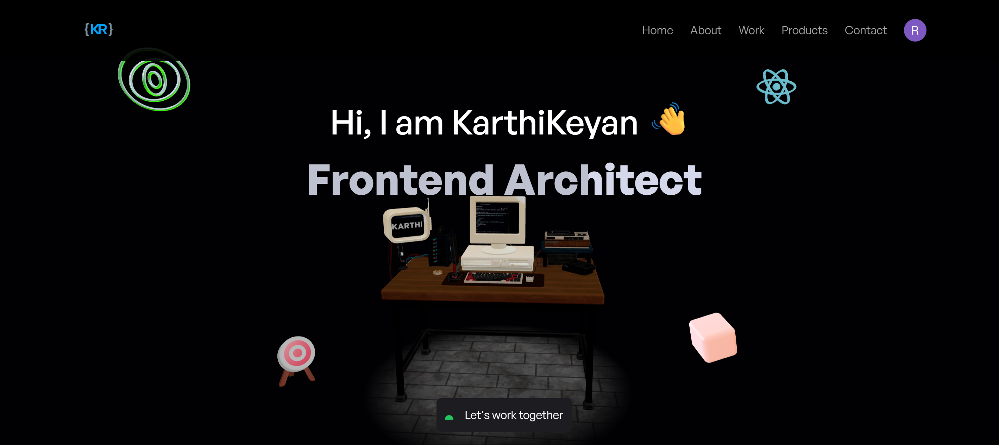

# 🎬 KCU — Karthick Creative Universe

<p align="center">
  
</p>

<div style="margin-top:10px" align="center">
  
  
  
  
  
  
  
  
  
  
</div>

<div align="center">
  <p>
<strong>KCU</strong> is an immersive 3D portfolio experience built with React Three Fiber, GSAP animations, AI-generated cinematic intros, and interactive 3D models — merging art, technology, and storytelling in one platform.
  </p>
  <p><a href="https://karthi-nexus.vercel.app/RenderGate" target="_blank"><strong>🌐 Experience the Cinematic Portfolio</strong></a></p>
</div>

---

## 📋 Table of Contents

1. [Introduction](#-introduction)
2. [Technical Description](#-technical-description)
3. [Tech Stack](#-tech-stack)
4. [Features](#-features)
5. [Quick Start](#-quick-start)
6. [Installation](#-installation)
7. [Development](#-development)
8. [Production Build](#-production-build)
9. [Deployment](#-deployment)
10. [License](#-license)
11. [Acknowledgements](#-acknowledgements)

---

### 🚀 Introduction

**Karthick Creative Universe (KCU)** is a 3D, cinematic React-based portfolio that turns the visitor’s journey into an interactive film-like experience.  
It blends **AI-powered media**, **secure authentication**, and **interactive 3D elements** to showcase projects and skills in a visually striking way.

---

### 🧠 Technical Description

KCU is a **React Three.js portfolio** designed to engage visitors through:

- AI-generated **cinematic intro videos** with **Google Veo3**.
- **Clerk authentication** to secure exclusive content.
- **React Three Fiber** & **GSAP** for rich 3D animations.
- A modular, component-driven design for easy updates.

#### **Core Architecture**

- **Frontend**: React 19 + Vite for blazing fast builds.
- **3D Rendering**: React Three Fiber + Three.js.
- **Animation**: GSAP & Leva controls.
- **Auth & Email**: Clerk & EmailJS.
- **AI Integration**: Google Veo3 for video generation.
- **Deployment**: Vercel hosting.

---

### 🔧 Tech Stack (Summary)

- ⚛ **React 19**
- 🎨 **Three.js / React Three Fiber**
- 🌀 **GSAP**
- ✉ **EmailJS**
- 🔐 **Clerk Auth**
- 🎥 **Google Veo3 AI**
- ⚡ **Vite**
- 🌈 **Tailwind CSS**
- ☁ **Vercel**

---

## ⚙ Features

- 🎥 **AI-powered Cinematic Intro**
- 🔐 **Secure Authentication with Clerk**
- 🖼 **Interactive 3D Models**
- 💬 **AI-powered Assistant**
- 📜 **Bento-grid About Section**
- 💼 **Portfolio with Video Previews**
- 📧 **Contact Form with Confirmation Emails**
- 🛡 **Custom 404 Error Page**

---

## ⚡ Quick Start

### 📦 Prerequisites

- Node.js ≥ 18
- npm / yarn / pnpm

---

## 🛠 Installation

```bash
git clone https://github.com/KarthickRamAlagar/KarthiNexus.git
npm install
```
🔄 Development

```bash
npm run dev
```
Your app will run at:

```
http://localhost:5173
```

🏗️ Production Build

```bash
npm run build
```

Preview build:

```bash
npm run preview
```

☁ Deployment
✅ Vercel (Recommended)
✅ Docker Supported


---

## 🪪 License

MIT License

---

## 🙏 Acknowledgements

- React Three Fiber
- Three.js
- GSAP
- Clerk
- EmailJS
- Google Veo3
- Vercel
- Tailwind CSS

---


